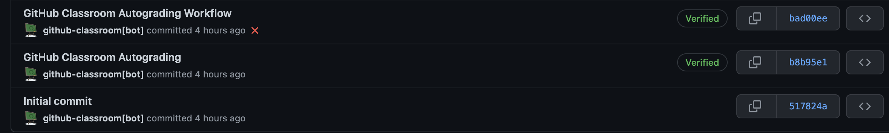
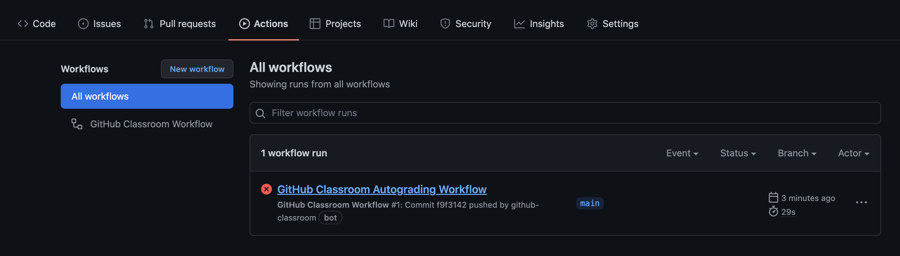

# autograding-troubles-js

After accepting a GitHub Classroom assignment, you should get a link to your own repo with the initial code and auto-grading setup.

If everything worked as it should you will see:
- A directory called `.github`:
    - 
- 3 commits with the  following messages:
    - 
- A failing workflow on a list under the `Actions` tab in your repo:
     - 

### Problem

If anything from the above list is not true for your repo, you won't be able to get auto-grading for your assignment.

### Solution

To solve the described problem, just copy the `.github` directory from this repo into yours. 

You can see how it helps in [this video](https://www.loom.com/share/386623480f0a4d87959513b81bbbb5a7).
